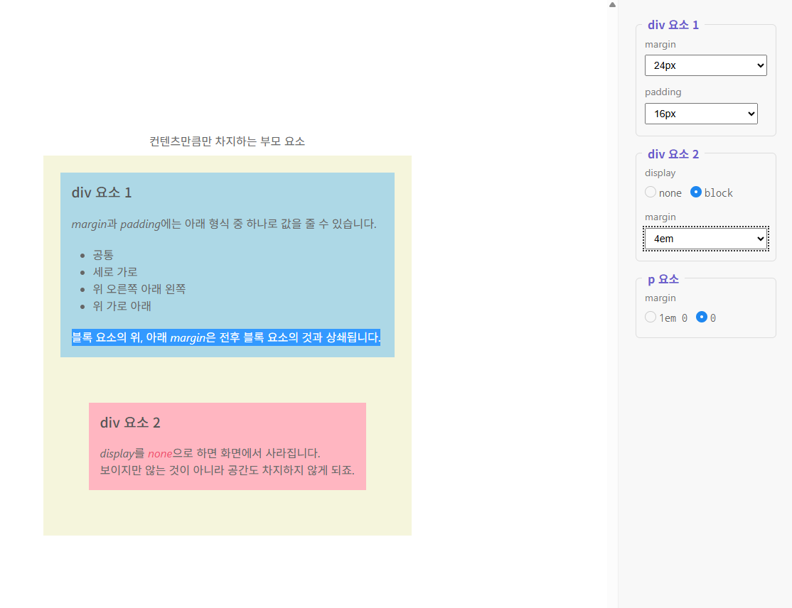
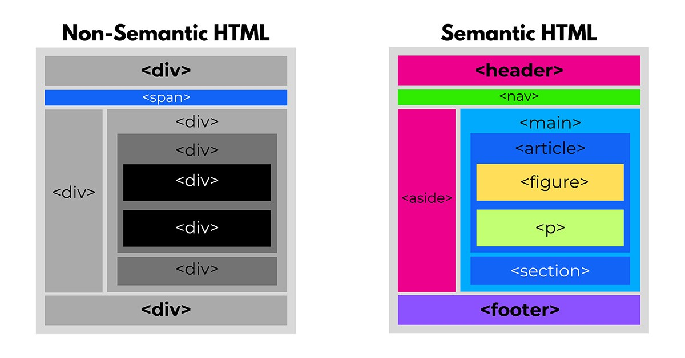

## 태그 속성 사용
-태그에 추가정보 부여시사용 태그옆에 _특정_단어를 붙이고 _값_을 지정하면 다양한표현가능

## 태그속성 (=특성)
- html태그의 속성을 영어 원문 상 python과 동일하게 attribute를 사용한다 근데 mdn문서에서 특성이라고 번역한다. 
예시
   1. `<html lang="ko">`
    2. ``
현재는 대부분의 강의에서 속성이라고표기하고있고..속성이란 표현을 중심으로표현

// 알트내에 있는텍스트보여주기 img src="" alt = ""
예시
'<html lang = "ko">'
''
img는 그림을 넣어주는태그인데 원본 파일명이 src속성에 들어가고 그림파일이 없을경우 대신표시할 alt속성이 존재한다 이 img태그 내의 src alt 속성은 p태그나 h1태그엔 존재하지않는다 즉 태그의 동작을 설정및제어하는것이다. 
이것이 **태그의속성(특성)**이며 각 태그마다 설정가능한속성이잇다
*
''
''

### 인용문관련 태그
특정 텍스트를 외부에서 가져와 인용하거나 참조할 때 사용.
1. '<blockqute>'

```html
<div>
  <blockquote cite="https://www.huxley.net/bnw/four.html">  <! -- cite는 속성 : 출처 표기용 --> 
    <p>
      Words can be like X-rays, if you use them properly—they’ll go through
      anything. You read and you’re pierced.
    </p>
  </blockquote>
  <p>—Aldous Huxley, <cite>Brave New World</cite></p>
</div>


```


'&lt;<blockquote>&gt;'= <blockquote>`

## 인용문 참조
- 어떤 태그 작성 시 img태그의 경우 default 로 src와 alt의 속성이 자동생성되었지만
아닌경우도있다 근데 특정속성이 태그 생성시에 꼭 포함되었으면 좋겠다면 사용할수있는
emmet이 존재한다 예를들어 blockquote 을 입력할때 cite 속성이 같이자동생성되면 좋지만
blockquote[cite] 까지입력하고 tab했을 때 완성된다 cite속성도 만들어진다.

그리고 less than greater than 부분
'<>'를 입력하고자 할 때, html 파일 내에서 
작성하면 tag 이름으로 인식하기 때문에 브라우저에는 출력이되지않는다. 이때 부등호를 다른 대체 텍스트로 입력해주는 작업필요. 이를 
_엔티티 이름_ 라한다.

예시
1. '<' : &lt;  - less than 
2. '>' : &gt;  - greater than
3. ' ' : &nbsp; - non breaking space

- blockquote정리
대표적인 특징으로 인용내용을 들여쓰기로 표현.
적어도 두 세줄 이상일때 가치있다.

짧은 텍스의 경우엔 '<q>'를 사용할 수 있다. 
quote의 축약어. 마찬가지로 인용이니까 cite속성을 지니고있다.

qtag.html만들고 사전설정 

'<mark>' 태그는 단순 강조 뿐만 아니라 _어떤 페이지에서 사용자가 특정 키워드들로 검색했을 때 해당 키워드를 표시하는 용도 ... 그래서 웹페이지에서 ctrl+f 눌러 검색했을때 그 문서내에 특정 단어가 다 mark 적용되어서 표시됨을 확인.

-머리글자태그

```html
<body>
      <h1> abbr 태그 머리 글자 표현</h1>
      <p>
        <strong>abbr </strong>태그를 사용하여
        <abbr title = "HyperText Markup Language" = HTML </abbr> (HyperText Markup Language) 을 표기한
        문단. 페이지의 소스 코드로 코드확인
      </p>  
 </body>
 </html>
```
## 태그로 여러 요소 나열  
- 어떤 정보를 나여랗ㄹ때 목록으로 표기하면 시인성이 높아진다, 이런목록을ㄹ 표기할때 순서가 없는 태그와 순서가 존재하는 태그로나뉜다.

## 목록을 표현하는 태그
- '<u>'태그는 unordered list 축약어로 순서가 상관없는 리스트를 만들때 사용한다,

```html

<ul>
    <li>사과
    <li>딸기
    <li>포도
</ul>
```

<ul>
    <li>사과
    <li>딸기
    <li>포도 
</ul>

- '<ol>'
```html

<ol>
    <li>알파
    <li>베타
    <li>감마
</ol>
```
<ol>
    <li>알파
    <li>베타
    <li>감마
</ol>

이상의 두 경우 나오는 '<li>'태그는 list item의 축약어로 ''<ul>'및'<ol>'는 

특히 '<ol>'의 속성
1. type = "A"로 지정하면 ABCD,,
2. default 값은 12345..
3. type을 지정하면 start속성도 지정가능 index와 달리 1부터시작

## 용어정의 나열하는태그
 어떤 리스트를 1대1로 매칭하는 경우가 있다.
 예를 들어 apple/사과 ,grape/포도 
 용어:정의가 가능하고 1대1대응도 가능하고 n:n도 가능 
 즉 여러 용어에 하나의정의를 붙이고ㅓ나 하나의 단어에 여러정의가있을수잇다.

 - '<dl>'태그 :definition list의 축약어로 정의 목록이라고 번역됩니다
 - '<dt>'태그 :definition term의 축약어로 정의할 용어를 뜻합니다.
 - '<dd>'태그 :definition description의 축약어로 용어의 설명 혹은 의미 해석으로 볼 수 있습니다.

 ##ch02_element 폴더 생성 01_imgtag1.html

 ## 이미지 태그 사용
 ## 절대경로와 상대경로 이미지넣기
 ''
 -src속성은 필수 요소로 당연히 이미지를 보여주는 것이 목표이기 때문에 어느
 파일을 보여줄지 지정해야함
 - alt속성은 해당 이미지를 불러올 수 없는 상황을 대비학 위한 대체텍스트
 - title 속성의 경우  툴팁(이미지에 커서를 갖다댔을 때 나타나는 창)에 표기되는 텍스트로 최근에는 반응형으로 인해 모바일에서 이미지를 보게되는 경우가 많아 중요도가 좀떨어짐
 
 

 참조 : 상대경로 표시 시의 ./과 ../의 차이점
 ./은 현재폴더 표시 ../는 상위폴더표시 

 과제: 해당파일에서 이미지태그를 사용하여 coding.png를출력
 (markup을 사용) / 대체 텍스트 :코딩중인 노트북/

 

  ## 표 사용하기

 table>caption(tr>td*3)*3 으로 emet작성

 1. '<table>' : 표 전체를 김싸는 태그 영역 내가표로 만들어진다.
 2. '<caption>' : 표의 각 행을 나타내는 태그
 3. '<tr>' : 각 행 안의 열을 지정하는 table data cell 의 축약어 태그 
 4. `<td>' : 각 행 안의 열을 지정하는 table data cell의 축약어 태그


```html
 <h1>header 및 footer 적용 테이블 생성</h1>
  <table>
    <caption>웹 개발 공부 기록</caption>
    <thead>
      <tr>
        <th scope="col">과목</th>
        <th scope="col">월</th>
        <th scope="col">화</th>
        <th scope="col">수</th>
      </tr>
    </thead>    
    <tbody>
    <tr>
      <td scope="row">HTML</th>
      <td>60분</td>
      <td>60분</td>
      <td>0분</td>
    </tr>
    <tr>
      <td scope="row">CSS</th>
      <td>0분</td>
      <td>30분</td>
      <td>60분</td>
    </tr>
    <tr>
      <td scope="row">JS</th>
      <td>60분</td>
      <td>90분</td>
      <td>120분</td>
    </tr>
</tbody>
    <tfoot>
      <tr>
        <td scope="row">총 시간</td>
        <td>120분</td>
        <td>180분</td>
        <td>180분</td>
      </tr>
    </tfoot>
  </table>
</body>
</html>

```
1. '<thead>' : 테이블을 만들었을 때 sqld기준으로 column명에 해당한다 자바에선 필드
2. '<tbody>' : 테이블 자체의 본문 컬럼명에 헤딩하는 값들  자바에선 필드
3. '<tfoot>' : 테이블의 요약본들을 추가적으로 표기하기 위한영영 
4. '<th>'    : 각 데이터의 제목에 해당하는 부분을 표기하는 영역
 -scope 속성 :
 1 "row" : 가로영역을 나타내는 제목
 2 "col" : 세로영역을 나타내는 제목
눈에보이는 부분뿐아니라 역할에 적합한 태그에 속성값까지 써주게 되면 컴퓨터가 인식하기 쉽기때문에 시인성도높고 스크린리더기에도 적합하게나온다.
04. tablespantag.html

```html
<!DOCTYPE html>
<html lang="en">
<head>
  <meta charset="UTF-8">
  <meta name="viewport" content="width=device-width, initial-scale=1.0">
  <title>1월 달력</title>
  <link rel="stylesheet" href="https://showcases.yalco.kr/html-css/01-06/table.css">
</head>
<body>
    <h1>시간 남으면 캘린더 만들어주세요</h1>
  <table>
    <caption>2026년 1월</caption>
    <colgroup>
        <col class="weekend">
        <col span="5">
        <col class="weekend">
    </colgroup>
    <tr>
      <th scope="col">일</th>
      <th scope="col">월</th>
      <th scope="col">화</th>
      <th scope="col">수</th>
      <th scope="col">목</th>
      <th scope="col">금</th>
      <th scope="col">토</th>
    </tr>
    <tr>
      <td>-</td>
      <td>-</td>
      <td>-</td>
      <td>-</td>
      <td>1</td>
      <td>2</td>
      <td>3</td>
    </tr>
    <tr>
      <td>4</td>
      <td>5</td>
      <td>6</td>
      <td>7</td>
      <td>8</td>
      <td>9</td>
      <td>10</td>
    </tr>
    <tr>
      <td>11</td>
      <td>12</td>
      <td>13</td>
      <td>14</td>
      <td>15</td>
      <td>16</td>
      <td>17</td>
    </tr>
    <tr>
      <td>18</td>
      <td>19</td>
      <td>20</td>
      <td>21</td>
      <td>22</td>
      <td>23</td>
      <td>24</td>
    </tr>
    <tr>
      <td>25</td>
      <td>26</td>
      <td>27</td>
      <td>28</td>
      <td>29</td>
      <td>30</td>
      <td>31</td>
    </tr>
  </table>
</body>
</html>
```
1. '<colgroup>' 테이블의 특정 열을 그룹으로 묶어 공통적인 속성을 넣ㅇ러주고 싶을 때 사용
'<col>' class라는 속성과 span이란 속성이 있다. 
-주의사항 : class는 속성명이기 때문에 col이 정의되어있다면 당연히 있다. "weekend:라는 속성값은 사용자정의값이다.
- span :  `<td colspan="">`이 아니라 col태그 내의 span속성에 해당된다 헤당 열이 몇 개의 칸을 차지할것인가를 의미한다. td  colspan 경우 하나의 td셀이 가로로 영역을 잡아먹는 것을 의미하고, col 태그의 span 속성은 각각의 column에 작용한다고 이해하시면 되겠습니다.
# 다른곳으로 링크
## 태그로 링크이동
-형식 : 
'<a bref = "연결할주소" target= "링크를 열 곳 옵션" > 제목 </a>'
```html
<!DOCTYPE html>
<html lang="en">
<head>
  <meta charset="UTF-8">
  <meta name="viewport" content="width=device-width, initial-scale=1.0">
  <title>Document</title>
</head>
<body bgcolor="5f5f5f">
  <p>
      <a href = "https://www.google.com/" target= "링크를 열 곳 옵션" > 제목 </a>
  </p>
  <p>
      <a href = "https://www.google.com/" target= "링크를 열 곳 옵션" > 제목 </a>
  </p>   
      <a href = "https://www.google.com/" target= "_blank" ></a>
  <p>
      
  

  <p>
      <a href = "https://www.google.com/" target= "_blank" > </a>
        </a>

  </p>
      
</body>
</html>
```
1. table태그 학습, tbody 파트에서 tr row 를 설정 구글네이버 카카오 검색엔진으로 달아두고  

2. td에 각 검색 엔진 아이코ㅓㄴ을 설정하고 아이콘을 클릭했을 때 실제로 페이지 이동이 일어나도록한다.

3. 다음 td에 검색 엔진의 특징을 간략하게 찍어두면 테이블과 a태그 이미지태그를 다 활용

4. 추가적으로 더 복잡하게 하고싶다면 thead를 적용하여 검색엔진명 링크이동아이콘 검색엔진특징등으로 설정하여 설정하여 정보제공가능

## id값으로 원하는 위치로 이동
'p#targer_${타겟_&}*100'

emmet에서 알 수 있는 점
1. '#' :태그내에서 아이디 속성명
2. '&' : 동적으로 변하는 값을 임의적으로 나타냄
3. '[속성명]' : 임의의 속성명을 적을 대 쓰는 대괄호
4. '{쓸내용}' : 태그와 닫는 태그 내에 작성하게 될 내용을 나타낼때 씀

## 태그로 연락처 연결하기

연락처를 연결하기위해선 href속성 내에서 
mailto: / tel:을 이용

1. '<a href = ' mailto: a@test.com'>a@test.com</a>'
2. `<a href = 'tel:010-1234-5678">010-1234-5678</a>`>

# 참조 
전화번호 링크를 컴퓨터에서 클릭하면 관련 앱이나 파일 프로그램을 선택하도록 되어있습니다. -> 연결 프로그램으로 뭐 쓸지 선택하는 창이 나올 확률이 높습니다. 하지만 모바일의 경우 전화 기능이나 혹은 email 기능으로 바로 연결되는 편입니다. 아이폰->mail앱 / 안드로이드->gmail앱이거나 default 앱으로 연결

이상을 모두 합쳐서 생각했을 때 `<a>`태그는 http:// / https:// 뿐만 아니라 전화번호/이메일로의 연결이 가능하다는 점입니다. 그리고 심지어 텍스트를 클릭해서 넘어가는 것 뿐만 아니라 이미지 등 다양한 응용 방법이 있습니다.

# ch03_inputs / 01_formtag.html 생성하고 기초 설정하겠습니다.
- 웹 페이지를 사용할 때 아이디와 패스워드를 입력한다거나 체크하고 고르는 등 사용자로부터 입력 받아야 하는 정보들이 있습니다. 이 때 사용하는 form 태그를 중심으로 수업합니다.
## `<form>` 태그 사용하기 - 자바의 scanner
- 사용자로부터 입력을 받기 위한 양식을 작성하는 태그를 통틀어서 지칭하는 용어.
### `<form>` 태그의 속성

```html
<!DOCTYPE html>
<html lang="en">
<head>
  <meta charset="UTF-8">
  <meta name="viewport" content="width=device-width, initial-scale=1.0">
  <title>Document</title>
</head>
<body bgcolor="5f5f5f">
  <h1>01_formtag.html</h1>
  <form action="01_formtag.html"method= "get">
    <label for="name">이름</label>
    <input id="name" name="my name type= "text">
    <br><br>
    <label for="age">나이</label>
    <input id="age" name="my-age" type="number">
    <br><br>
    <button type="submit">제출</button>
    <button type="reset">초기화</button>
  </form>
  
</body>
</html>
```

- 위에서 사용되는 속성들
1. '<form>'태그
-action
-method
-현재수준에서 경험해보지 못한 우리가 이름과 나이를 입력했을때 그 정보를 가져가서 보여주는 결과 페이지에 해당한다. form태그  내에 action/method 소ㅓㄱ서ㅏㅇ이 있다는 것만알아두기

2. <input>태그
-챕터를 따로빼서..설명
- name : html에서 특별한 의미를 갖는게 아니라 서버에서 각 항목을 받을 때 무엇에 대한 값인지 구분할수있도록 구분하는 용도에해당 

3. '<label>' 태그 input태그와 유기적으로 연결 input태그에 부여한 id속성을 label태그에서 for속성에서 불러옴
for와 id가 서로 연결되어있다
label과 input은 서로 연결되어있다
버튼 인풋 중요
4. '<button>' 태그 : 
- type -submit /reset으로 정의되어있음
 submit의 경우 입력한 결과값을 최종 서버나 특정 페이지 주소로 보내는 즉 제출하는 용도
 reset은 입력한내용을 모두 초기화 

 추가학습
 ```html
 <!DOCTYPE html>
<html lang="en">
<head>
  <meta charset="UTF-8">
  <meta name="viewport" content="width=device-width, initial-scale=1.0">
  <title>Document</title>
</head>
<body bgcolor="5f5f5f">
  <h1>01_formtag.html</h1>
  <form action="01_formtag.html"method= "get">
    <fieldset>
      <legend>개인신상정보</legend>
      <label for="name">이름</label>
      <input id="name" name="my name type= "text">
      <br><br>
      <label for="age">나이</label>
      <input id="age" name="my-age" type="number">

    </fieldset>
    <label for="age">나이</label>
    <input id="age" name="my-age" 
    <br><br>
    <button type="submit">제출</button>
    <button type="reset">초기화</button>
  </form>
  
</body>
</html>
```